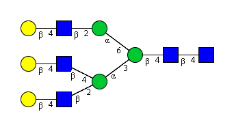
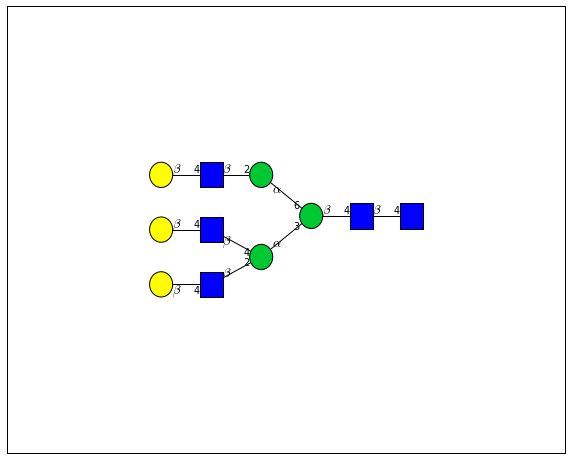
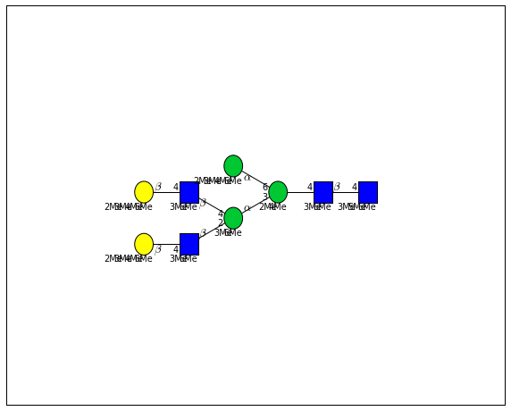
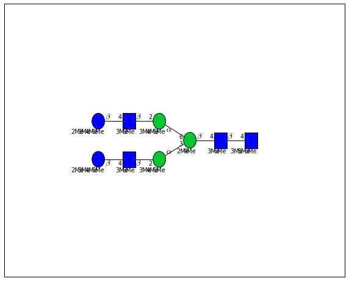
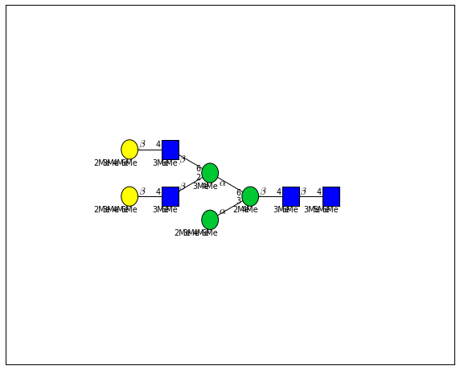
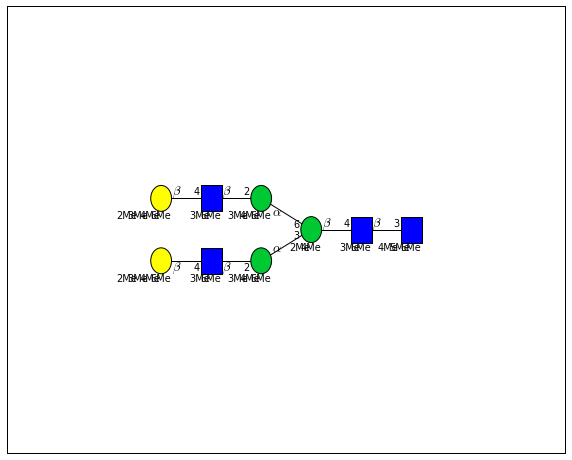

.. code-block:: python

    import glypy
    from glypy.io import glycoct
    from glypy.structure import (glycan, monosaccharide, substituent)
    
    from glypy import plot
    from glypy.algorithms import subtree_search, database
    
    %matplotlib inline
    from matplotlib import rcParams
    rcParams["figure.figsize"] = 10, 8
    from IPython.display import display, Image

The Database Module
===================

When we are interested in finding out what kinds of structures we might
have in some unknown data, the first place we start is with "what do we
think is possible?". This usually involves reading articles and
hand-tuning a hypothesis to test. Alternatively, we can throw everything
possible at the data and to see what sticks. In both of these cases we
need to actually have a collection of structures that we can curate,
annotate, and test.

The ``database`` module is here for provide a convenient and performant
container for glycan structures, implemented on top of ``sqlite3``.
We've pre-package all of the definite structures in Glycome-DB, which
you can download from PyPI or with the ``glypy.io.glycomedb`` module,
directly from `www.glycome-db.org <www.glycome-db.org>`__.

Let's assume you've downloaded the database and it's in your current
directory

.. code-block:: python

    glycomedb = database.dbopen("./glycomedb.db")
    glycomedb

.. parsed-literal::

    <RecordDatabase 28431 records>

Depending upon the version of ``glypy`` you have, you may see fewer or
more records as the library matures to handle more irregular structures.
As of this moment, it doesn't attempt to represent structures with
``REP`` repeating elements or ``UND`` undefined subgraphs. This version
was created as strictly as possible, so if we didn't represent it
exactly, it wasn't included.

If you're familiar with SQL, this block of code explains the structure
of the table as it is stored on disk in an SQLite database file.

.. code-block:: sql

    CREATE TABLE GlycanRecord(
        glycan_id INTEGER UNIQUE PRIMARY KEY NOT NULL, 
        mass float NOT NULL,
        structure TEXT NOT NULL, glycoct TEXT, /* Special */
        is_n_glycan BOOLEAN,
        composition VARCHAR(120)
    );

The ``structure`` field is special, it contains all of the data about
this record as a ``Python`` object,
`pickled <https://docs.python.org/2/library/pickle.html>`__ and
serialized in the database. This means we can add anything we like to
the Python object without needing to map it to a column in the database.
However, if we can map something to a column in the table, we can search
against it quickly.

Searching the Database
----------------------

The database object, ``glycomedb`` here, wraps an SQLite connection. In
other words, it can do everything
`sqlite3.Connection <https://docs.python.org/2/library/sqlite3.html?highlight=sqlite3#connection-objects>`__
does, execute SQL commands to quickly search, filter, add, or remove
records.

Here we'll search for every entry in the database that has the N-Glycan
Core motif, which has been mapped to the ``is_n_glycan`` column.

.. code:: python

    import time
    start = time.time()
    i = len(list(glycomedb.from_sql(glycomedb.execute("SELECT * FROM GlycanRecord WHERE is_n_glycan=1;"))))
    end = time.time()
    i, end - start

.. parsed-literal::

    (5443, 33.504000186920166)

It took 33 seconds to search nearly 28,000 records and extract those
that match the criterion. This is good if we routinely want to select
something depending upon whether or not it's an N-Glycan.

Some structures in ``Glycome-DB`` are reduced, meaning they have an
alditol group on their reducing end. This isn't mapped to the table
schema above, but we can still search the database using pure
``Python``. The database class, ``RecordDatabase``, will by default
iterate over all of the records in the ``GlycanRecord`` table in the
order they were inserted. Each record is an object of the class
``GlycanRecord``, which holds a ``Glycan`` object in its ``structure``
attribute, and lots of other annotations to be shown later.

.. code:: python

    start = time.time()
    i = 0
    for rec in glycomedb:
        if rec.structure.reducing_end is not None:
            i += 1
    end = time.time()
    i, end - start

.. parsed-literal::

    (3040, 77.43799996376038)

Looping over all 28,000 records in Python was over 2x slower, over a
minute to run. Though this comparison is not totally fair, it is a good
argument for using SQL to search. The slowest step is constructing the
object from the database. This keeps only one object in memory time.

We can also access records by their database ID number, if we know it.
For example
`Glycome-DB:183 <http://www.glycome-db.org/database/showStructure.action?glycomeId=183>`__

.. code:: python

    import urllib2
    Image(urllib2.urlopen("http://www.glycome-db.org/getSugarImage.action?id=183&type=cfg").read())

.. code:: python

    record183 = glycomedb[183]
    draw_tree, axes = plot.plot(record183, label=True, scale=0.15)
    
    print record183
    print record183.taxa

.. parsed-literal::

    <GlycanRecord 183 2005.72436779>
    RES
    1b:b-dglc-HEX-1:5
    2s:n-acetyl
    3b:b-dglc-HEX-1:5
    4s:n-acetyl
    5b:b-dman-HEX-1:5
    6b:a-dman-HEX-1:5
    7b:b-dglc-HEX-1:5
    8s:n-acetyl
    9b:b-dgal-HEX-1:5
    10b:b-dglc-HEX-1:5
    11s:n-acetyl
    12b:b-dgal-HEX-1:5
    13b:a-dman-HEX-1:5
    14b:b-dglc-HEX-1:5
    15s:n-acetyl
    16b:b-dgal-HEX-1:5
    LIN
    1:1d(2+1)2n
    2:1o(4+1)3d
    3:3d(2+1)4n
    4:3o(4+1)5d
    5:5o(3+1)6d
    6:5o(6+1)13d
    7:6o(2+1)10d
    8:6o(4+1)7d
    9:7d(2+1)8n
    10:7o(4+1)9d
    11:10d(2+1)11n
    12:10o(4+1)12d
    13:13o(2+1)14d
    14:14d(2+1)15n
    15:14o(4+1)16d
    
    [<Taxon tax_id=9031 name=None entries=None>, <Taxon tax_id=9913 name=None entries=None>, <Taxon tax_id=11033 name=None entries=None>, <Taxon tax_id=9606 name=None entries=None>, <Taxon tax_id=9940 name=None entries=None>]
    

If you look at the picture, this is the same structure, but you also see
it's ``GlycoCT``\ representation when the object is printed out. Another
of the facets of the ``GlycanRecord`` class is the storage for
provenance information, like species the structure is associated with.
The data-dump from ``Glycome-DB`` only contains taxon id numbers. You
might recognize 9606 as Human, but the others are probably unfamiliar.

It's outside the scope of this project to automatically include that
sort of information, however the
`taxonomylite <http://pythonhosted.org//taxonomylite/>`__ package
(disclaimer: I am the an author and the maintainer) does this job
nicely. If we also have downloaded or built a ``Taxonomy`` database from
``taxonomylite``, we can put names to those numbers:

.. code:: python

    import taxonomylite
    taxa_db = taxonomylite.Taxonomy("taxonomy.db")
    [(taxa_db.tid_to_name(taxon.tax_id), taxon.tax_id) for taxon in record183.taxa]

.. parsed-literal::

    [(u'Gallus gallus', '9031'),
     (u'Bos taurus', '9913'),
     (u'Semliki Forest virus', '11033'),
     (u'Homo sapiens', '9606'),
     (u'Ovis aries', '9940')]

We could also mix the ``Taxonomy`` database directly into ``glycomedb``,
but that would quadruple the file size.

Because ``GlycanRecord`` objects are *just* ``Python`` objects, we can
add new attributes to them and save them to the database for later.

.. code:: python

    record183.fragments = list(record183.structure.fragments("AXBYCZ"))
    print len(record183.fragments)
    record183.update()

.. parsed-literal::

    220
    

Here we've added a new attribute, and called the record's ``update()``
method, which writes its current state to the database. If we go load
the record from disk again, the new attribute should still be present.

.. code:: python

    len(glycomedb[183].fragments)

.. parsed-literal::

    220

An Application
--------------

What if we wanted to do something like build a database of human
N-Glycan structures? We could do it easily in memory by doing something
like this:

.. code:: python

    human_n_glycans = []
    for row in glycomedb.execute("SELECT * FROM GlycanRecord WHERE is_n_glycan=1;"):
        record = glycomedb.record_type.from_sql(row, glycomedb) # Convert each raw row into GlycanRecord instance
        for taxon in record.taxa:
            if taxon.tax_id == "9606":
                human_n_glycans.append(record)
                break
    print len(human_n_glycans)

.. parsed-literal::

    888
    

1. This first reduces the number of records to search in ``Python`` by
   using SQL to quickly pull out all N-Glycans, then convert those rows
   of the database to python objects using ``from_sql()``.
2. For each record retrieved, test if any of its taxa are Human. If so,
   add them to the list and move on to the next record

So we have 888 records in memory. While we're at it, we'll say the
experiment we have in mind will be on permethylated, reduced glycans, so
let's reduce them and derivatize them.

.. code:: python

    from glypy.composition.composition_transform import derivatize
    
    for record in human_n_glycans:
        record.structure.set_reducing_end(True)
        derivatize(record.structure, "methyl")
    

The records are still in memory. We can write them to disk in
``glycomedb``, but that's probably not what we want, since we've
transformed these structures and we want to keep our reference database
clean. We can create a new database object to save them in easily
though.

First, let's remember that we really wanted to be able to tell easily if
a structure was "high mannose" or not. We'll say something is "high
mannose" if it has more than 5 Hexose in its composition. This
classification may be dubious, but for some applications, it may be
valid. We could make it a new attribute on the object, but that would
probably take too long to filter by. Let's try adding it to the new
database's table schema.

To do that, we first need to create a new record type, derived from
``GlycanRecord``

.. code:: python

    def is_high_mannose(record):
        return int(record.monosaccharides['Hex'] > 4)
    
    @database.column_data("is_high_mannose", "BOOLEAN NOT NULL", is_high_mannose)
    class IsHighMannoseGlycanRecord(database.GlycanRecord):
        pass
    
    experiment_db = database.dbopen("experiment.db", record_type=IsHighMannoseGlycanRecord, flag='w')
    experiment_db.load_data(human_n_glycans, set_id=False)
    experiment_db.apply_indices()
    print len(experiment_db)
    

.. parsed-literal::

    888
    

This new class is a straight copy of the ``GlycanRecord`` class's
internal logic, except that it now includes a new column in the mapped
SQL schema. The column, ``is_high_mannose``, is declared as a
``BOOLEAN`` data type, and it is mapped by this function:

.. code:: python

    def is_high_mannose(record):
        return int(record.monosaccharides['Hex'] > 4)

You might ask why the result is cast to an ``int`` instead of left as
``True`` or ``False``. The reason is that SQLite doesn't have a key word
literal for boolean values, and just treates 0 as ``False`` and any
other number as ``True``.

The resulting table schema looks like:

.. code:: sql

    /* Generaged by calling '\n'.join(IsHighMannoseGlycanRecord.sql_schema()) */
    CREATE TABLE GlycanRecord(
        glycan_id INTEGER UNIQUE PRIMARY KEY NOT NULL,
        mass float NOT NULL,
        structure TEXT NOT NULL, glycoct TEXT,
        is_high_mannose BOOLEAN, /* Newly created */
        is_n_glycan BOOLEAN,
        composition VARCHAR(120));

Notice the new column added. We can now quickly filter structures by the
``is_high_mannose`` criterion. After loading the data, we call
``apply_indices`` to index the database by mass. We could add more
indices if we wished to by executing raw SQL.

.. code:: python

    start = time.time()
    res = len(list(experiment_db.from_sql(experiment_db.execute("SELECT * FROM GlycanRecord WHERE is_high_mannose=1;"))))
    res, time.time() - start

.. parsed-literal::

    (595, 10.51199984550476)

.. code:: python

    i = 0
    start = time.time()
    for record in experiment_db:
        if is_high_mannose(record):
            i += 1
    i, time.time() - start

.. parsed-literal::

    (595, 105.88299989700317)

.. code:: python

    start = time.time()
    i = 0
    for record in human_n_glycans:
        if is_high_mannose(record):
            i += 1
    i, time.time() - start 

.. parsed-literal::

    (595, 108.72199988365173)

Using the precomputed SQL field, we can find and extract all 595 records
in 10 seconds. Doing it with a database iterator takes 10 times longer.
This is because it needs to construct every record and executes the test
over and over again.

Mass Searching
--------------

If we know we're looking for all the entries in our database which are
near a particular mass value, it's straight-forward to query

.. code:: python

    for match in (experiment_db.ppm_match_tolerance_search(2063.0773, 1e-5)):
        plot.plot(match, label=True, scale=0.135)

.. image:: output_29_0.png

.. image:: output_29_2.png

.. image:: output_29_5.png

.. image:: output_29_6.png

.. image:: output_29_7.png

.. image:: output_29_9.png

.. image:: output_29_11.png

.. image:: output_29_14.png

.. image:: output_29_15.png

.. image:: output_29_17.png

It looks like there are several linkage variants of the many similar
topologies and composition in the database that match that mass.

If we had tandem mass spectra with the critical fragment, say a cross
ring cleavage along the central Mannose of the N-Glycan Core motif, we
could discern which broad topology we had. With MSn, determining linkage
would be doable too.
