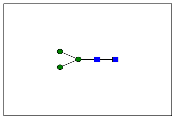
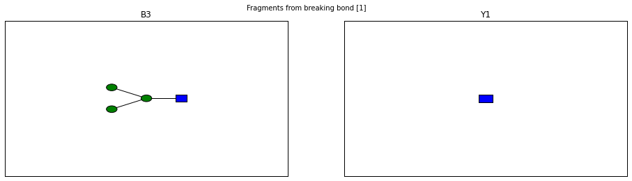
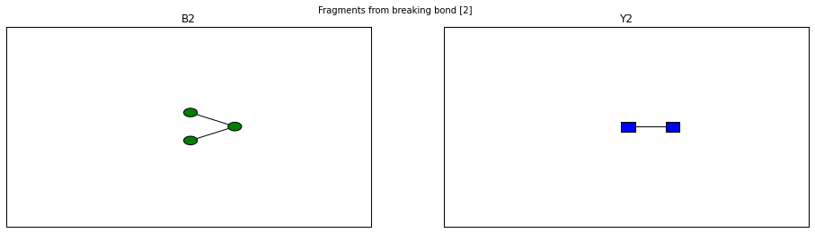
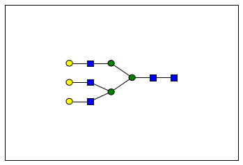
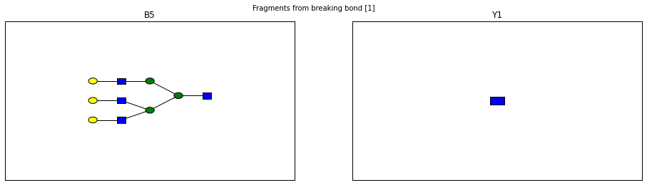
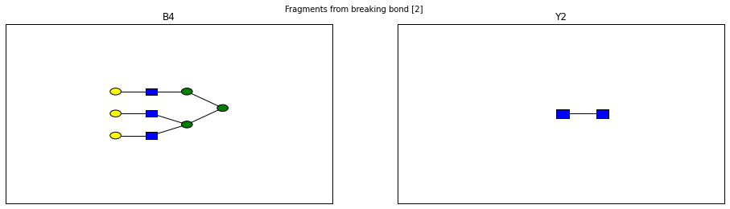
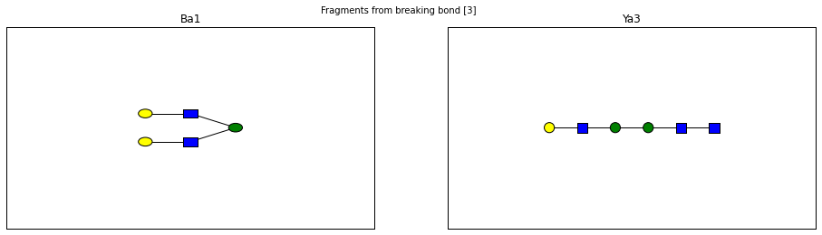
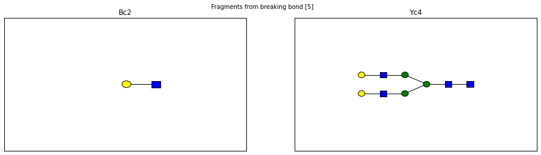
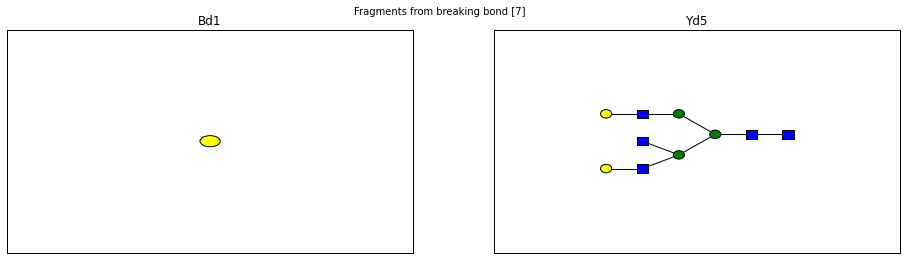
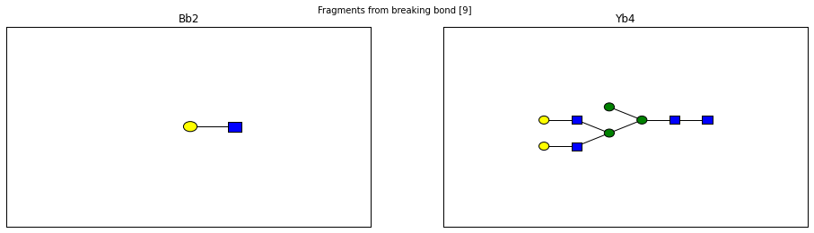

glypy Quickstart
----------------

The basic building block of a glycan is a monosaccharide.
Monosaccharides are an extremely diverse family of molecules, but their
features are relatively consistent across these variations.

The object-model in ``glypy`` is designed to let you specify aspects of
a monosaccharide without placing each carbon by hand, but still allowing
you full control over the gross structure of the object.

.. code:: python

    import glypy
    monosaccharide = glypy.Monosaccharide(anomer='beta', superclass='hex', configuration='d', stem='glc', ring_start=1, ring_end=5)
    print(monosaccharide)
    monosaccharide.mass()

.. parsed-literal::

    RES 1b:b-dglc-HEX-1:5
    

.. parsed-literal::

    180.0633881022

Behold,
`Glucose <http://www.monosaccharidedb.org/display_monosaccharide.action?id=4>`__.
If you follow the link to MonosaccharideDB, you'll see that the mass
reported is the monoisotopic mass of the monosaccharide.

By default, all sugars are printed out in *condensed GlycoCT* format.

Here, we've made a monosaccharide whose anomeric carbon is in the
:math:`\beta` configuration, whose backbone contains six carbons,
forming a right-handed stereo-structure, with the ring topology of
Glucose, starting at carbon 1 and closing at carbon 5.

That was a lot to write for just a molecule of glucose. For convenience,
you can also create new common monosaccharides by:

.. code:: python

    glypy.monosaccharides['Glucose']

.. parsed-literal::

    RES 1b:b-dglc-HEX-1:5

There is a long list of available names available, some of which are
synonyms.

.. code:: python

    print(glypy.monosaccharides["Glc"])
    print('--')
    print(glypy.monosaccharides["Glucose"])
    print('--')
    print(glypy.monosaccharides["bdGlc"])

.. parsed-literal::

    RES 1b:b-dglc-HEX-1:5
    --
    RES 1b:b-dglc-HEX-1:5
    --
    RES 1b:b-dglc-HEX-1:5
    

Because there are so many names for the same thing, it can sometimes be
useful to consult a synonym index or an identity test if you happen upon
a name you do not recognize

.. code:: python

    from glypy.io.nomenclature import synonyms, identity
    
    print(synonyms.monosaccharides['Glc'])
    identity.is_a(monosaccharide, "Glucose")

.. parsed-literal::

    [u'Glucose', u'bdGlc', u'LinearCode:G']
    

.. parsed-literal::

    True

Putting Pieces Together
~~~~~~~~~~~~~~~~~~~~~~~

.. code:: python

    monosaccharides = glypy.monosaccharides
    
    glcnac1 = monosaccharides["GlcNAc"]
    glcnac2 = monosaccharides["GlcNAc"]
    
    glcnac1.add_monosaccharide(glcnac2, position=4)
    bdman = monosaccharides["bdMan"]
    glcnac2.add_monosaccharide(bdman, position=4)
    adman1 = monosaccharides["adMan"]
    bdman.add_monosaccharide(adman1, position=3)
    adman2 = monosaccharides["adMan"]
    bdman.add_monosaccharide(adman2, position=6)
    
    n_linked_core = glypy.Glycan(root=glcnac1)
    print(n_linked_core)
    print(n_linked_core.mass())
    print(n_linked_core.total_composition())

.. parsed-literal::

    RES
    1b:b-dglc-HEX-1:5
    2s:n-acetyl
    3b:b-dglc-HEX-1:5
    4s:n-acetyl
    5b:b-dman-HEX-1:5
    6b:a-dman-HEX-1:5
    7b:a-dman-HEX-1:5
    LIN
    1:1d(2+1)2n
    2:1o(4+-1)3d
    3:3d(2+1)4n
    4:3o(4+-1)5d
    5:5o(3+-1)7d
    6:5o(6+-1)6d
    
    910.327779978
    Composition({'H': 58, 'C': 34, 'O': 26, 'N': 2})
    

What we did here created each monosaccharide unit that composes the core
of an N-linked glycan, and connected them together to form a tree or
graph structure. Each bond links a parent residue to one of its children
in the language of trees, where the first parent is the residue at the
reducing end.

At the end, in order to create something aware of the entire tree
structure and not just an individual node in it, we created an instance
of the ``Glycan`` class from the first residue, the root of the tree.

To see what we made here, we can look at both a textual representation
and an image of the tree

.. code:: python

    from glypy.plot import plot
    %matplotlib inline
    
    plot(n_linked_core)
    
    print(n_linked_core)

.. parsed-literal::

    RES
    1b:b-dglc-HEX-1:5
    2s:n-acetyl
    3b:b-dglc-HEX-1:5
    4s:n-acetyl
    5b:b-dman-HEX-1:5
    6b:a-dman-HEX-1:5
    7b:a-dman-HEX-1:5
    LIN
    1:1d(2+1)2n
    2:1o(4+-1)3d
    3:3d(2+1)4n
    4:3o(4+-1)5d
    5:5o(3+-1)7d
    6:5o(6+-1)6d
    
    

The process of putting together all of those building blocks can be
repetative as well, so the N-glycan core structure is made available in
``glypy.glycans`` just as ``glypy.monosaccharides`` provided a
shortcut for creating individual monosaccharides

.. code:: python

    premade_core = glypy.glycans['N-Linked Core']
    premade_core == n_linked_core

.. parsed-literal::

    True

Operating on Glycans
~~~~~~~~~~~~~~~~~~~~

The real use for this library comes from manipulating glycan structure.
We can add and remove monosaccharides, substituents, and modifications
per base, derivatize the whole glycan structure, and generate fragments.

Basic operations such as iteration traverse the glycan structure using a
depth-first traversal that selects branches by bond order.

.. code:: python

    accumulated_total_mass = 0
    for monosaccharide in n_linked_core:
        print(monosaccharide)
        print(monosaccharide.mass())
        accumulated_total_mass += monosaccharide.mass()
        print('-------------')
    
    print(accumulated_total_mass, n_linked_core.mass())

.. parsed-literal::

    RES 1b:b-dglc-HEX-1:5 2s:n-acetyl LIN 1:1d(2+1)2n
    220.082112171
    -------------
    RES 1b:b-dglc-HEX-1:5 2s:n-acetyl LIN 1:1d(2+1)2n
    203.07937252
    -------------
    RES 1b:b-dman-HEX-1:5
    161.044998386
    -------------
    RES 1b:a-dman-HEX-1:5
    163.060648451
    -------------
    RES 1b:a-dman-HEX-1:5
    163.060648451
    -------------
    (910.32777997822, 910.32777997822)
    

This shows each distinct monosaccharide unit composing the total
structure and their discrete masses after composition loss from forming
glycosidic bonds. This total mass is the same as mass of the glycan.

We can traverse the structure in many other ways using the ``iternodes``
function, which is called by the `Python iterator
protocol <https://docs.python.org/2/library/stdtypes.html#iterator-types>`__,
``__iter__``. A feature worth pointing out is that the ``iternodes``
function allows you to pass a callback to influence how it emits
residues. For instance, ``Glycan.leaves()`` is implemented similar to
this

.. code:: python

    import itertools
    
    def leaves(self):
        def is_leaf(obj):
            if len(list(obj.children())) == 0:
                yield obj
    
        return itertools.chain.from_iterable(self.iternodes(apply_fn=is_leaf))
        
    print("The leaf nodes, or `terminal nodes` of the N-linked core")
    for leaf in leaves(n_linked_core):
        print(leaf)
        print('---')

.. parsed-literal::

    The leaf nodes, or `terminal nodes` of the N-linked core
    RES 1b:a-dman-HEX-1:5
    ---
    RES 1b:a-dman-HEX-1:5
    ---
    

As you can see, if you can create a sequence of only nodes that satisfy
some constraint, such as number of child nodes, it is easy to build an
iterator pipeline to perform more complex graph transformations. You can
also iterate over each link in the glycan using ``Glycan.iterlinks()``.
This is useful if you want to perform an operation on each ``Link``
object.

Like breaking them.

Glycan Fragmentation
^^^^^^^^^^^^^^^^^^^^

A core goal of ``glypy`` is supporting flexible glycan fragmentation.
An example of this operation with the N-linked core:

.. code:: python

    for fragment_ion in n_linked_core.fragments():
        print(fragment_ion)

.. parsed-literal::

    <Fragment kind=Y link_ids=[1] included_nodes=[1] mass=221.089937203>
    <Fragment kind=B link_ids=[1] included_nodes=[2, 3, 4, 5] mass=689.237842775>
    <Fragment kind=Y link_ids=[2] included_nodes=[2, 1] mass=424.169309723>
    <Fragment kind=B link_ids=[2] included_nodes=[3, 4, 5] mass=486.158470255>
    <Fragment kind=Y link_ids=[3] included_nodes=[3, 2, 1, 4] mass=748.27495656>
    <Fragment kind=B link_ids=[3] included_nodes=[5] mass=162.052823418>
    <Fragment kind=Y link_ids=[4] included_nodes=[3, 2, 1, 5] mass=748.27495656>
    <Fragment kind=B link_ids=[4] included_nodes=[4] mass=162.052823418>
    

To connect a fragment to its place in the original structure, you can
retrieve the disjoint sub-trees from a fragmentation by using the
function ``fragment_to_substructure`` in the ``glycan`` module.

.. code:: python

    from matplotlib import pyplot as plt
    from glypy.structure.glycan import fragment_to_substructure
    
    for links, frags in itertools.groupby(n_linked_core.clone().fragments(), lambda f: f.link_ids):
        
        y_ion, b_ion = frags
        y_tree, b_tree = [fragment_to_substructure(frag, n_linked_core) for frag in (y_ion, b_ion)]
        
        fig, axes = plt.subplots(1,2)
        b_ax, y_ax = axes
        fig.set_size_inches(16, 4)
        plot(y_tree, ax=y_ax, center=True)
        plot(b_tree, ax=b_ax, center=True)
        y_ax.set_title(n_linked_core.name_fragment(y_ion))
        b_ax.set_title(n_linked_core.name_fragment(b_ion))
        fig.suptitle("Fragments from breaking bond {}".format(links))
    
        

.. image:: output_21_2.png

.. image:: output_21_3.png

The ``Glycan.fragments()`` algorithm mutates the object, iteratively as
removing and restoring links between the constituent ``Monosaccharide``
objects. Because we want to use the object's structure for
``fragment_to_substructure``, it is important to copy the object before
fragmenting it. All of ``glypy``'s common structures,
``Glycan, Monosaccharide, Link, Substituent,`` and ``ReducedEnd`` have a
``clone`` method.

This is all useful, but what we probably want something more complex
than just the core structure to work with. GlycomeDB is the most
up-to-date (at the time of this writing) functional Glycomics database.
Taking `Entry
183 <http://www.glycome-db.org/database/showStructure.action?glycomeId=183>`__,
we can get something a little more complicated.

It would be a nuisance to have to manually create each residue, and as
we've already seen, ``glypy`` knows about ``GlycoCT``

.. code:: python

    from glypy.io import glycoct
    
    glycomedb183_glycoct = '''
    RES
    1b:b-dglc-HEX-1:5
    2s:n-acetyl
    3b:b-dglc-HEX-1:5
    4s:n-acetyl
    5b:b-dman-HEX-1:5
    6b:a-dman-HEX-1:5
    7b:b-dglc-HEX-1:5
    8s:n-acetyl
    9b:b-dgal-HEX-1:5
    10b:b-dglc-HEX-1:5
    11s:n-acetyl
    12b:b-dgal-HEX-1:5
    13b:a-dman-HEX-1:5
    14b:b-dglc-HEX-1:5
    15s:n-acetyl
    16b:b-dgal-HEX-1:5
    LIN
    1:1d(2+1)2n
    2:1o(4+1)3d
    3:3d(2+1)4n
    4:3o(4+1)5d
    5:5o(3+1)6d
    6:6o(2+1)7d
    7:7d(2+1)8n
    8:7o(4+1)9d
    9:6o(4+1)10d
    10:10d(2+1)11n
    11:10o(4+1)12d
    12:5o(6+1)13d
    13:13o(2+1)14d
    14:14d(2+1)15n
    15:14o(4+1)16d
    '''
    
    glycomedb183 = glycoct.loads(glycomedb183_glycoct)
    plot(glycomedb183)
    glycomedb183

.. parsed-literal::

    RES
    1b:b-dglc-HEX-1:5
    2s:n-acetyl
    3b:b-dglc-HEX-1:5
    4s:n-acetyl
    5b:b-dman-HEX-1:5
    6b:a-dman-HEX-1:5
    7b:b-dglc-HEX-1:5
    8s:n-acetyl
    9b:b-dgal-HEX-1:5
    10b:b-dglc-HEX-1:5
    11s:n-acetyl
    12b:b-dgal-HEX-1:5
    13b:a-dman-HEX-1:5
    14b:b-dglc-HEX-1:5
    15s:n-acetyl
    16b:b-dgal-HEX-1:5
    LIN
    1:1d(2+1)2n
    2:1o(4+1)3d
    3:3d(2+1)4n
    4:3o(4+1)5d
    5:5o(3+1)6d
    6:5o(6+1)13d
    7:6o(2+1)10d
    8:6o(4+1)7d
    9:7d(2+1)8n
    10:7o(4+1)9d
    11:10d(2+1)11n
    12:10o(4+1)12d
    13:13o(2+1)14d
    14:14d(2+1)15n
    15:14o(4+1)16d

.. code:: python

    for links, frags in itertools.groupby(glycomedb183.clone().fragments(), lambda f: f.link_ids):
        
        y_ion, b_ion = frags
        y_tree, b_tree = [fragment_to_substructure(frag, glycomedb183) for frag in (y_ion, b_ion)]
        
        fig, axes = plt.subplots(1,2)
        b_ax, y_ax = axes
        fig.set_size_inches(16, 4)
        plot(y_tree, ax=y_ax, center=True)
        plot(b_tree, ax=b_ax, center=True)
        y_ax.set_title(glycomedb183.name_fragment(y_ion))
        b_ax.set_title(glycomedb183.name_fragment(b_ion))
        fig.suptitle("Fragments from breaking bond {}".format(links))
    
        

.. image:: output_25_3.png

.. image:: output_25_7.png

.. image:: output_25_9.png

Derivatization
~~~~~~~~~~~~~~

So this structure is fancier than our last case, but we're probably not
studying it in its native state. Permethylation is a popular technique
for glycan analysis in glycan mass spectrometry.

.. code:: python

    from glypy.composition.composition_transform import derivatize
    
    case = glycomedb183.clone()
    print("Clone is identical? {}".format(case == glycomedb183))
    
    derivatize(case, 'methyl')
    print("Clone is identical? {}".format(case == glycomedb183))
    
    print("Derivatized Mass: {}, Native Mass: {}, Mass Delta: {}".format(
            case.mass(), glycomedb183.mass(), case.mass() - glycomedb183.mass()))
    

.. parsed-literal::

    Clone is identical? True
    Clone is identical? False
    Derivatized Mass: 2496.27212004, Native Mass: 2005.72436779, Mass Delta: 490.547752245
    

